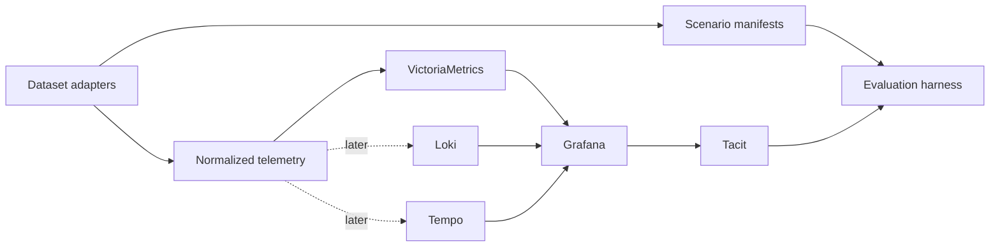

# Real Telemetry Dataset Testing Roadmap

Tacit's current validation suite is useful for deterministic regression testing, but much of its telemetry is synthetic. This roadmap adds public observability datasets in controlled milestones so Tacit can be evaluated against real metric catalogs, real service topologies, and labeled incidents.

Grafana remains the visualization and datasource-discovery layer. It is not the telemetry store. Metrics are loaded into a Prometheus-compatible time-series database; logs and traces remain in their native backends and are introduced only when investigation-plan generation is ready to use them as evidence.

## Principles

- Keep downloaded datasets and converted telemetry out of Git.
- Preserve source data and checksums; make normalization reproducible.
- Shift timestamps without changing relative event timing.
- Never use trace IDs, request IDs, log messages, or unbounded interface names as metric labels.
- Keep original metric names in the manifest even when a normalized name is required.
- Every replayable incident must have a machine-readable ground-truth manifest.
- Start with bounded samples. Full-corpus ingestion begins only after correctness, cardinality, and query-cost gates pass.
- Evaluate evidence quality, not merely HTTP success or dashboard creation.

## Local Architecture



VictoriaMetrics is exposed to Grafana as a standard Prometheus datasource, so the existing Tacit Prometheus adapter and PromQL compiler remain the integration boundary. The OpenTelemetry Collector accepts official OTLP fixtures and forwards their metrics through Prometheus remote write.

## Dataset Inventory

| Dataset | Signals | Ground truth | Scale / access | Primary Tacit use |
|---|---|---|---|---|
| [ClickStack sample](https://clickhouse.com/docs/use-cases/observability/clickstack/getting-started/sample-data) | Metrics, logs, traces | Checkout failure caused by a full payment cache | Small OTLP JSON archive | Demo and end-to-end multimodal smoke test |
| [LO2](https://zenodo.org/records/14265858) | Primarily service logs; sparse metrics and mostly empty/single-span traces | Correct runs, expected OAuth2 rejection cases, and a small number of broken runs | 1.1 GB sample; 46.5 GB full archive, about 540 GB expanded | Negative-control, missing-artifact, log-noise, and ingestion-scale evaluation |
| [GAMMA](https://www.kaggle.com/datasets/gagansomashekar/microservices-bottleneck-detection-dataset) | Metrics, logs, request traces | Injected single and simultaneous resource bottlenecks | About 40 million traces; Apache-2.0 | Multi-bottleneck localization |
| [Alibaba microservice trace 2021](https://github.com/alibaba/clusterdata/blob/master/cluster-trace-microservices-v2021/README.md) | Node/container metrics, call rate, response time, call graphs | Production behavior rather than injected fault labels | About 61 GB compressed | Scale, cardinality, topology, and downstream-latency evaluation |
| [Illinois/FIRM traces](https://databank.illinois.edu/datasets/IDB-6738796) | Unsampled preprocessed traces | Anomaly target encoded by file; execution paths supplied | 2.98 GB; CC0 | Trace culprit ranking across four benchmark applications |

LO2 is not a primary root-cause accuracy benchmark. Its appendix reports 1,740 correct runs out of 93,583, 934,935 empty artifacts, and an almost-always-empty aggregate Jaeger trace. Correct and error cases also have sharply different artifact sizes, creating an easy leakage path through run duration and file volume. Use LO2 to test whether Tacit avoids inventing infrastructure causes for expected functional rejections, handles sparse artifacts, retrieves evidence from very noisy logs, and scales ingestion. Any LO2 evaluation must exclude filenames, expected HTTP outcomes, artifact size, run duration, and missing-file counts from model evidence and scoring.

The Illinois dataset should remain trace-shaped; converting component duration vectors into synthetic metrics would discard its execution-path and culprit-localization value.

## Normalization Contract

Bounded metric labels:

```text
dataset
scenario_id
run_id
service
instance
node
environment
fault_type
fault_target
phase
```

Required scenario manifest fields:

```yaml
schema_version: 1
scenario_id: gamma-cpu-memory-001
dataset: gamma
prompt: "Social network latency increased without obvious errors"
window:
  source_start: "..."
  source_end: "..."
  replay_start: "..."
  replay_end: "..."
ground_truth:
  fault_types: [cpu_contention, memory_contention]
  affected_services: []
  root_cause_services: []
expected_signals:
  - cpu_utilization
  - memory_utilization
  - request_latency
```

Each adapter must produce a manifest containing source URL, version, license, checksum, conversion command, row/sample counts, dropped-record counts, metric names, label cardinalities, and the timestamp transformation used for replay.

## Milestones

### M1: ClickStack Metrics Demo

**Branch:** `codex/demo-real-telemetry`

**Status:** Implemented and live-verified on 2026-06-18. The official sample replay imported 667 OTLP batches and exposed 368 metric names. The canonical prompt generated six non-empty panels, all routed to the `real-telemetry` datasource.

Tie the first real-data milestone directly to the existing checkout incident demo:

- add VictoriaMetrics and an OpenTelemetry Collector to the development stack;
- provision VictoriaMetrics in Grafana as a Prometheus datasource;
- download the official ClickStack sample on demand, without committing it;
- replay only `metrics.json` for this milestone;
- rebase cached OTLP timestamps to the current replay window while preserving relative timing;
- approve and hot-register a known-good dashboard backed by imported metrics;
- generate a dashboard for the checkout/payment cache incident;
- verify that selected metrics exist in the imported catalog and return data;
- retain logs and traces in the archive for M5.

**Exit gates**

- Grafana reports the real-telemetry datasource healthy.
- At least one OTLP metric is queryable through Grafana's datasource proxy.
- Tacit discovers the imported catalog without a custom adapter.
- The generated dashboard contains non-empty real-data panels.
- The run produces one successful investigation-history record.
- The demo remains runnable with one documented command after the stack starts.

#### M1 Accuracy Assessment

Overall: promising beta accuracy, but not yet trustworthy without validation gates. Roughly 6.5/10.

**What worked well**

- Intent classification was strong. It consistently recognized error spikes, cache saturation, resource pressure, and payment-service context.
- The canonical real-data prompt selected all six relevant ClickStack panels.
- Query validation successfully rejected many nonexistent or incompatible metrics instead of publishing fabricated evidence.
- After the routing fixes, every final target used the correct real-telemetry datasource.

**Where accuracy weakened**

- Broad prompts caused aggressive archetype blending and produced 20+ irrelevant candidate panels.
- Before our fixes, plausible dashboards silently used synthetic data instead of the requested dataset.
- Signal inference understood only 3 of 9 ClickStack metrics confidently.
- Cache hits, misses, and evictions were incorrectly classified as generic request-rate signals.
- Cache size and Redis client pressure were left unmapped.
- Metric conventions and labels caused otherwise sensible generic templates to return no data.
- Dashboard summaries can mention datasources used before validation, rather than only those in surviving panels.

**Scorecard**

| Dimension | Score |
|---|---|
| Intent/archetype recognition | 8/10 |
| Query hallucination protection | 8/10 |
| Metric semantic understanding | 5/10 |
| Datasource routing after fixes | 8/10 |
| Robustness to prompt variation | 5/10 |
| Real-world investigation usefulness | 7/10 learned, 4–5/10 cold |

The synthetic benchmark's 90% top-1 archetype accuracy is credible for classification, but its 78.9% metric recall likely overstates real-world performance. With only one fully validated external scenario, a statistical accuracy claim would be premature. The encouraging part is that the architecture fails visibly: unsupported panels are dropped and the real-data tests exposed incorrect routing. M2 (GAMMA) will tell us whether ClickStack was a repeatable capability or a well-tuned success case.

**Required work**

- Build 25–40 paraphrases of the ClickStack incident: vague, precise, noisy, misleading, and differently worded.
- Evaluate cold-start and learned-dashboard performance separately.
- Use metric metadata, units, labels, and OTel scope to improve semantic inference.
- Add explicit cache signals: size, hit ratio, misses, evictions, memory pressure, client pressure.
- Rank archetypes by live metric coverage before blending them.
- Keep generated archetypes out of normal retrieval. Evaluate exact-scope candidates
  only through the side-effect-free shadow path defined by
  [ADR-020](adr/020-generated-archetypes-shadow-before-lifecycle.md).
- Cap irrelevant archetype blending and panel count.
- Ensure summaries describe only surviving panels and datasources.
- Validate each query independently, not merely whether one query in a panel returns data.

**Release gates**

| Gate | Target |
|---|---|
| Semantic mapping precision | ≥90% |
| Semantic mapping coverage | ≥80% |
| Critical-signal recall (cold) | ≥75% |
| Critical-signal recall (learned) | ≥90% |
| Correct datasource routing | 100% |
| Hallucinated published metrics | 0 |
| Irrelevant surviving panels | <15% |
| Supported prompt variants producing useful dashboards | ≥85% |
| Typical dashboard size | 4–10 panels |

Use the frozen convention-faithful GAMMA slice only as a regression guard; it is not evidence about the real incidents. Preserve its existing failures and move to the real GAMMA corpus rather than tuning further against curated fixtures.

### M2: GAMMA Multi-Bottleneck Metrics

**Branch:** `codex/dataset-gamma-bottlenecks`

**Status:** The frozen 29-run pre-evidence-model baseline completed on 2026-06-22. Canonical and prefix-only evidence recall both passed at `6/6`; raw neutral ownership abstained at `0/3` dashboards; the diverse controls recorded `0/20` false culprits and `20/20` abstentions with zero cache hits. All ten evidence-absent symptoms were discovered, but symptom panel survival was `0/10`, and culprit ranking remains unavailable. Proceed to first-class evidence requirements/resolutions/observations before fallback. See `docs/results/gamma-pilot-baseline-2026-06-19.md`, `docs/results/gamma-naming-diagnostic-2026-06-20.md`, and `docs/results/gamma-pre-evidence-model-baseline-2026-06-22.md`.

- download the archive through Kaggle and record its version, license, and checksum;
- inventory the real file schemas before writing normalization rules;
- begin with a bounded pilot containing baseline, single-bottleneck, and simultaneous-bottleneck scenarios;
- ingest CPU, memory, I/O, network, and request-latency time series;
- model interference intensity, duration, VM, and affected services in manifests;
- cover single-resource and simultaneous bottlenecks;
- test whether Tacit ranks multiple plausible causes without flooding the dashboard.

**Pilot gates:** reproducible download and checksum, schema inventory, machine-readable ground truth, bounded labels, timestamp alignment, successful VictoriaMetrics import, Grafana discovery, and at least one non-empty Tacit investigation using real GAMMA metrics.

**Evaluation gates:** fault-type recall, culprit-service top-k accuracy, mixed-bottleneck recall, unsupported-cause rate, and bounded panel duplication. Record cold-start and learned-dashboard results separately, and preserve the first real-corpus result as the untuned baseline.

**Execution order:** Freeze and hash the protocol, prompts, scorer, expected arm outcomes, and denominators before a run.
Require positive evidence recall during binding so silence cannot pass. Use the lightweight cause-assertion detector for
healthy/evidence-absent controls before full ranking exists. Run the controls before guarded fallback, immediately after
fallback, and again after culprit ranking. Do not open the larger scenario gate until at least 20 controls have been
scored with explicit scenario-level numerators and denominators.

**PR sequence:** First introduce the lightweight evidence lifecycle (`EvidenceRequirement`, `EvidenceResolution`,
`EvidenceObservation`) and record evidence survival without changing dashboard behavior. Then use those objects to
preserve symptom evidence in evidence-absent controls. Only after survival is measurable should guarded fallback produce
candidate evidence, followed by culprit top-k scoring.

### M3: Alibaba Scale Metrics

**Branch:** `codex/dataset-alibaba-scale`

- stream node, microservice resource, call-rate, and response-time tables;
- begin with one cluster/time slice, then expand to the full twelve-hour trace;
- preserve joins among node, service, and instance IDs;
- establish catalog-size, label-cardinality, ingestion-throughput, discovery-latency, and query-cost budgets.

**Exit gates:** full metric corpus imports without loading archives wholly into memory, Tacit discovers useful signals under catalog limits, and representative queries stay within the agreed latency budget.

### M4: ClickStack Logs and Traces

**Branch:** `codex/demo-multimodal-investigation`

- add Loki and Tempo pipelines to the OpenTelemetry Collector;
- replay `logs.json` and `traces.json` from the same ClickStack archive;
- correlate signals using service name, timestamp, trace ID, and span ID;
- generate an investigation plan that identifies checkout failure, the payment service, and cache saturation with links to supporting evidence.

**Exit gates:** the plan cites at least one metric, trace, and log fact; unsupported claims are rejected; and the known payment-cache root cause ranks first.

### M5: Illinois/FIRM Trace Culprit Ranking

**Branch:** `codex/dataset-firm-traces`

- stream the 2.98 GB CSV archive without checking it into Git;
- reconstruct execution paths for social network, media, hotel reservation, and train ticket requests;
- map component-duration vectors into Tempo spans or a dedicated trace evidence representation;
- use anomaly-target filenames as ground truth;
- evaluate culprit ranking independently from metric selection.

**Exit gates:** execution paths survive conversion, trace IDs remain out of metric labels, and the injected component appears in Tacit's top-k investigation steps.

### M6: LO2 Negative-Control and Log-Scale Run

**Branch:** `codex/dataset-lo2-full`

- audit a small stratified sample of correct, expected OAuth2 rejection, and broken runs before full ingestion;
- treat expected 400/401/404 responses as functional outcomes rather than infrastructure incidents;
- explicitly exclude artifact size, run duration, filenames, outcome labels, and missing-file counts from investigation evidence;
- import any useful metric corpus incrementally only if the audit finds stable, comparable time series;
- ingest service logs into Loki with run/test/service labels;
- apply the dataset authors' log-reduction guidance to avoid initialization leakage;
- evaluate abstention from unsupported infrastructure causes, sparse-artifact handling, log deduplication, and evidence retrieval over the full corpus.

**Exit gates:** zero use of prohibited leakage features, bounded disk and memory use, resumable imports, no label explosion, low unsupported-cause rate on expected functional rejections, and stable evidence retrieval across repeated runs.

## Evaluation Matrix

Every scenario records:

1. Import completeness and rejected samples.
2. Datasource and metric discovery recall.
3. Correct service, problem type, and fault classification.
4. Ground-truth signal-selection precision and recall.
5. Query validity and non-empty panel ratio.
6. Panel duplication and irrelevant-panel ratio.
7. Root-cause service top-1 and top-3 rank.
8. Investigation-plan evidence coverage by signal type.
9. Unsupported-claim rate.
10. Ingestion time, catalog size, query latency, and storage use.
11. Repeatability across at least five LLM runs.
12. Dataset-specific leakage checks and prohibited evidence fields.

Results belong in versioned scenario reports, not in the source datasets themselves. Synthetic tests remain the fast regression layer; these dataset milestones become the realism and operational-usefulness layer.

## Branch and Delivery Policy

- M1 stays with the current demo initiative and can ship as one reviewable PR.
- Each later milestone starts from the updated default branch after M1 merges.
- Infrastructure shared by multiple datasets should be extracted only after the second adapter proves the common shape.
- Dataset downloads, converted output, and backend volumes remain ignored local artifacts.
- Each branch includes its adapter, manifest fixtures, focused tests, reproducible runbook, and a short results report.
