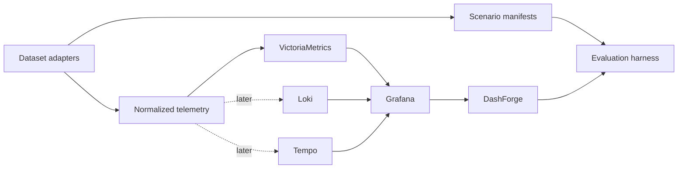

# Real Telemetry Dataset Testing Roadmap

DashForge's current validation suite is useful for deterministic regression testing, but much of its telemetry is synthetic. This roadmap adds public observability datasets in controlled milestones so DashForge can be evaluated against real metric catalogs, real service topologies, and labeled incidents.

Grafana remains the visualization and datasource-discovery layer. It is not the telemetry store. Metrics are loaded into a Prometheus-compatible time-series database; logs and traces remain in their native backends and are introduced only when investigation-plan generation is ready to use them as evidence.

## Principles

- Keep downloaded datasets and converted telemetry out of Git.
- Preserve source data and checksums; make normalization reproducible.
- Shift timestamps without changing relative event timing.
- Never use trace IDs, request IDs, log messages, or unbounded interface names as metric labels.
- Keep original metric names in the manifest even when a normalized name is required.
- Every replayable incident must have a machine-readable ground-truth manifest.
- Start with bounded samples. Full-corpus ingestion begins only after correctness, cardinality, and query-cost gates pass.
- Evaluate evidence quality, not merely HTTP success or dashboard creation.

## Local Architecture



VictoriaMetrics is exposed to Grafana as a standard Prometheus datasource, so the existing DashForge Prometheus adapter and PromQL compiler remain the integration boundary. The OpenTelemetry Collector accepts official OTLP fixtures and forwards their metrics through Prometheus remote write.

## Dataset Inventory

| Dataset | Signals | Ground truth | Scale / access | Primary DashForge use |
|---|---|---|---|---|
| [ClickStack sample](https://clickhouse.com/docs/use-cases/observability/clickstack/getting-started/sample-data) | Metrics, logs, traces | Checkout failure caused by a full payment cache | Small OTLP JSON archive | Demo and end-to-end multimodal smoke test |
| [LO2](https://zenodo.org/records/14265858) | Metrics and logs; limited single-span traces | Correct and 53 labeled API error tests | 1.1 GB sample; 46.5 GB full archive, about 540 GB expanded | Labeled anomaly and noisy-catalog evaluation |
| [GAMMA](https://www.kaggle.com/datasets/gagansomashekar/microservices-bottleneck-detection-dataset) | Metrics, logs, request traces | Injected single and simultaneous resource bottlenecks | About 40 million traces; Apache-2.0 | Multi-bottleneck localization |
| [Alibaba microservice trace 2021](https://github.com/alibaba/clusterdata/blob/master/cluster-trace-microservices-v2021/README.md) | Node/container metrics, call rate, response time, call graphs | Production behavior rather than injected fault labels | About 61 GB compressed | Scale, cardinality, topology, and downstream-latency evaluation |
| [Illinois/FIRM traces](https://databank.illinois.edu/datasets/IDB-6738796) | Unsampled preprocessed traces | Anomaly target encoded by file; execution paths supplied | 2.98 GB; CC0 | Trace culprit ranking across four benchmark applications |

LO2 should be treated primarily as a metrics-and-logs dataset. Its published traces generally contain a single span and many trace files are empty. The Illinois dataset should remain trace-shaped; converting component duration vectors into synthetic metrics would discard its execution-path and culprit-localization value.

## Normalization Contract

Bounded metric labels:

```text
dataset
scenario_id
run_id
service
instance
node
environment
fault_type
fault_target
phase
```

Required scenario manifest fields:

```yaml
schema_version: 1
scenario_id: gamma-cpu-memory-001
dataset: gamma
prompt: "Social network latency increased without obvious errors"
window:
  source_start: "..."
  source_end: "..."
  replay_start: "..."
  replay_end: "..."
ground_truth:
  fault_types: [cpu_contention, memory_contention]
  affected_services: []
  root_cause_services: []
expected_signals:
  - cpu_utilization
  - memory_utilization
  - request_latency
```

Each adapter must produce a manifest containing source URL, version, license, checksum, conversion command, row/sample counts, dropped-record counts, metric names, label cardinalities, and the timestamp transformation used for replay.

## Milestones

### M1: ClickStack Metrics Demo

**Branch:** `codex/demo-real-telemetry`

**Status:** Implemented and live-verified on 2026-06-18. The official sample replay imported 667 OTLP batches and exposed 368 metric names. The canonical prompt generated six non-empty panels, all routed to the `real-telemetry` datasource.

Tie the first real-data milestone directly to the existing checkout incident demo:

- add VictoriaMetrics and an OpenTelemetry Collector to the development stack;
- provision VictoriaMetrics in Grafana as a Prometheus datasource;
- download the official ClickStack sample on demand, without committing it;
- replay only `metrics.json` for this milestone;
- rebase cached OTLP timestamps to the current replay window while preserving relative timing;
- approve and hot-register a known-good dashboard backed by imported metrics;
- generate a dashboard for the checkout/payment cache incident;
- verify that selected metrics exist in the imported catalog and return data;
- retain logs and traces in the archive for M5.

**Exit gates**

- Grafana reports the real-telemetry datasource healthy.
- At least one OTLP metric is queryable through Grafana's datasource proxy.
- DashForge discovers the imported catalog without a custom adapter.
- The generated dashboard contains non-empty real-data panels.
- The run produces one successful investigation-history record.
- The demo remains runnable with one documented command after the stack starts.

### M2: LO2 Sample Metrics

**Branch:** `codex/dataset-lo2-metrics`

- download and checksum `lo2-sample.zip`;
- reuse the authors' merged per-run CSV files;
- normalize the first 100 runs into bounded Prometheus series;
- preserve correct/error labels in scenario manifests;
- compare generated dashboards for correct and erroneous API runs;
- add metric-selection precision, recall, and noise scoring.

**Exit gates:** repeatable import, no unbounded labels, labeled normal/error scenarios, and measurable dashboard differences between paired runs.

### M3: GAMMA Multi-Bottleneck Metrics

**Branch:** `codex/dataset-gamma-bottlenecks`

- ingest CPU, memory, I/O, network, and request-latency time series;
- model interference intensity, duration, VM, and affected services in manifests;
- cover single-resource and simultaneous bottlenecks;
- test whether DashForge ranks multiple plausible causes without flooding the dashboard.

**Exit gates:** fault-type recall, culprit-service top-k accuracy, and bounded panel duplication across mixed bottlenecks.

### M4: Alibaba Scale Metrics

**Branch:** `codex/dataset-alibaba-scale`

- stream node, microservice resource, call-rate, and response-time tables;
- begin with one cluster/time slice, then expand to the full twelve-hour trace;
- preserve joins among node, service, and instance IDs;
- establish catalog-size, label-cardinality, ingestion-throughput, discovery-latency, and query-cost budgets.

**Exit gates:** full metric corpus imports without loading archives wholly into memory, DashForge discovers useful signals under catalog limits, and representative queries stay within the agreed latency budget.

### M5: ClickStack Logs and Traces

**Branch:** `codex/demo-multimodal-investigation`

- add Loki and Tempo pipelines to the OpenTelemetry Collector;
- replay `logs.json` and `traces.json` from the same ClickStack archive;
- correlate signals using service name, timestamp, trace ID, and span ID;
- generate an investigation plan that identifies checkout failure, the payment service, and cache saturation with links to supporting evidence.

**Exit gates:** the plan cites at least one metric, trace, and log fact; unsupported claims are rejected; and the known payment-cache root cause ranks first.

### M6: Illinois/FIRM Trace Culprit Ranking

**Branch:** `codex/dataset-firm-traces`

- stream the 2.98 GB CSV archive without checking it into Git;
- reconstruct execution paths for social network, media, hotel reservation, and train ticket requests;
- map component-duration vectors into Tempo spans or a dedicated trace evidence representation;
- use anomaly-target filenames as ground truth;
- evaluate culprit ranking independently from metric selection.

**Exit gates:** execution paths survive conversion, trace IDs remain out of metric labels, and the injected component appears in DashForge's top-k investigation steps.

### M7: Full LO2 Logs and Scale Run

**Branch:** `codex/dataset-lo2-full`

- import the full metric corpus incrementally;
- ingest service logs into Loki with run/test/service labels;
- apply the dataset authors' log-reduction guidance to avoid initialization leakage;
- evaluate API-error classification and evidence retrieval over the full corpus.

**Exit gates:** bounded disk and memory use, resumable imports, no label explosion, and stable results across repeated runs.

## Evaluation Matrix

Every scenario records:

1. Import completeness and rejected samples.
2. Datasource and metric discovery recall.
3. Correct service, problem type, and fault classification.
4. Ground-truth signal-selection precision and recall.
5. Query validity and non-empty panel ratio.
6. Panel duplication and irrelevant-panel ratio.
7. Root-cause service top-1 and top-3 rank.
8. Investigation-plan evidence coverage by signal type.
9. Unsupported-claim rate.
10. Ingestion time, catalog size, query latency, and storage use.
11. Repeatability across at least five LLM runs.

Results belong in versioned scenario reports, not in the source datasets themselves. Synthetic tests remain the fast regression layer; these dataset milestones become the realism and operational-usefulness layer.

## Branch and Delivery Policy

- M1 stays with the current demo initiative and can ship as one reviewable PR.
- Each later milestone starts from the updated default branch after M1 merges.
- Infrastructure shared by multiple datasets should be extracted only after the second adapter proves the common shape.
- Dataset downloads, converted output, and backend volumes remain ignored local artifacts.
- Each branch includes its adapter, manifest fixtures, focused tests, reproducible runbook, and a short results report.
